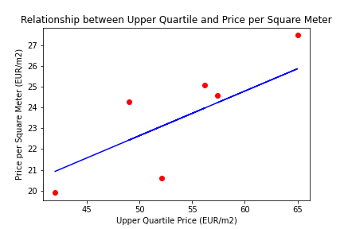

# Finland House Price Prediction Model

This repository contains a machine learning model to predict house prices based on relevant features. The model employs Linear Regression, Random Forest Regressor, and Decision Tree Regressor.

## Dataset

The dataset (`FinlandHousePrice.csv`) is used for training and evaluating the models. It includes the following columns:

- `Upper quartile`: Feature representing upper quartile prices.
- `Real price index`: Feature representing real price indices.
- `Number`: Feature representing the number of houses.
- `Price per square meter(EUR/m2)`: Target variable representing the price per square meter.

## Model Implementation

### Linear Regression

The Linear Regression model predicts house prices based on the 'Upper quartile' feature.

#### Data Visualization

A scatter plot is generated to visualize the relationship between the upper quartile price and the price per square meter.



#### Performance Metrics

- Mean Absolute Error (MAE): {mae}
- Mean Squared Error (MSE): {mse}
- Root Mean Squared Error (RMSE): {rmse}
- R-squared (R2): {r2}

### Random Forest & Decision Tree

Both Random Forest Regressor and Decision Tree Regressor models use features 'Upper quartile', 'Real price index', and 'Number' for predictions.

#### Random Forest

##### Performance Metrics

- Mean Absolute Error (MAE): {mae}
- Mean Squared Error (MSE): {mse}
- Root Mean Squared Error (RMSE): {rmse}
- R-squared (R2): {r2}

#### Decision Tree

##### Performance Metrics

- Mean Absolute Error (MAE): {mae}
- Mean Squared Error (MSE): {mse}
- Root Mean Squared Error (RMSE): {rmse}
- R-squared (R2): {r2}

## Usage

1. Clone the repository:

```bash
git clone https://github.com/Razib91lightspeed/House-Price-Prediction-Model.git
```

2. Change to the project directory:

```bash
cd Finland-House-Price-Prediction
```

3. Install the required dependencies:

```bash
pip install -r requirements.txt
```

4. Run the Jupyter Notebook:

```bash
jupyter notebook
```

5. Open this program using Spider IDE
- Spider

6. Explore the FinlandHousePricePrediction.ipynb notebook for a detailed walkthrough of the model implementation.

## Contributors
- Razib Hasan
- Huang Xiaosi
